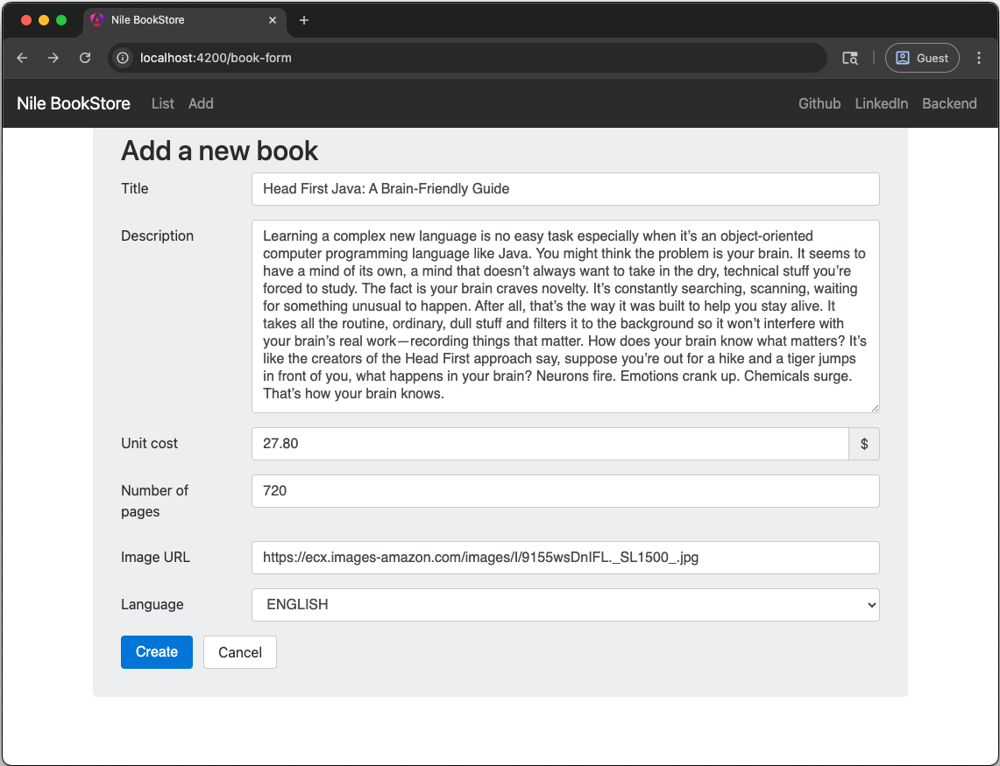
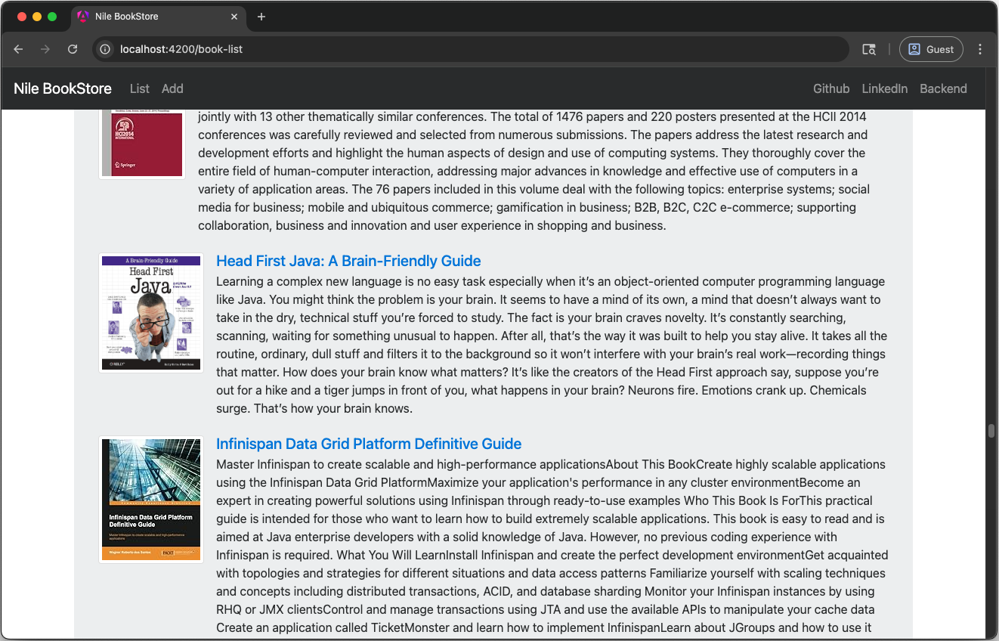

# BookStore

This is a simple Book Store web app developed with Java EE. Users can access an H2 database of books through the UI rendered by ThymeLeaf, and view, add, and delete books with the Servlet Controllers.

## Screenshots
The front page which lists all of the books:

Clicking on a book reveals its details:

Clicking "Create" on the navigation bar reveals the form to create a book in the database:

After creating, the book gets added to the database and appears in the list:

## Course Followed
This project follows the [Pluralsight Java EE 7: Getting Started](https://app.pluralsight.com/library/courses/java-ee-getting-started/table-of-contents) course, which covers the basics of Java EE development, including domain modeling, JTA, JPA, JAX-RS and RESTful services, unit and integration testing with JUnit and Arquillian, Bean Validation, and CDI.

## Technologies / Concepts Used
- **Java EE 7** (Servlets, JAX-RS, JPA, Hibernate, JTA, Bean Validation, CDI)
- **WildFly** for the application server
- **Thymeleaf** for server-side HTML rendering
- **Maven** as the build tool
- **RESTful web services** (JAX-RS and Servlets)
- **Dependency injection**
- **H2 database**
- **Unit and integration testing** (Arquillian, JUnit)
- **IntelliJ 2017 IDE**

## Future Ideas
- Add author domain and pages
- Implement book search and filtering
- Add pagination to book list
- Document the REST API
- Rewrite the HTML navigation bar code DRY
- More polished UI with Angular
- Rewrite using Spring Boot
- Add user authentication and authorization
- Integrate with external book APIs (like Google Books)
- Abillity to "rent" books
- Add links to Amazon or web page of the book
