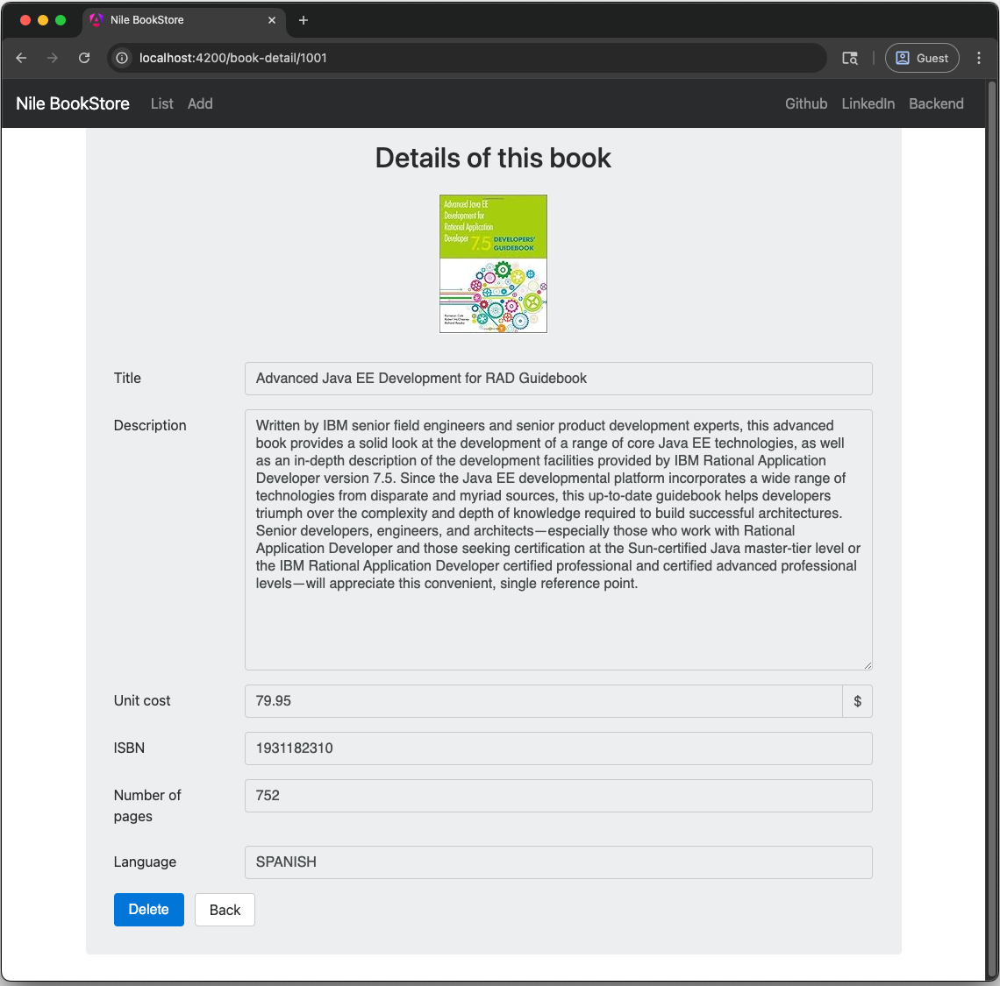

# BookStore

This is a Book Store web app developed with Java EE. Users can access and modify an H2 database of books through the UI rendered by Angular and Bootstrap with options to view, add, and delete books through the JAX-RS endpoints.

## Screenshots
The front page which lists all of the books:

Clicking on a book reveals its details:

Clicking "Create" on the navigation bar reveals the form to create a book in the database:

After creating, the book gets added to the database and appears in the list:

## Course Followed
This project follows the [PluralSight Java EE 7: Getting Started](https://app.pluralsight.com/library/courses/java-ee-getting-started/table-of-contents) course, which covers the basics of Java EE development, including domain modeling, JTA, JPA, JAX-RS and RESTful services, unit and integration testing with JUnit and Arquillian, Bean Validation, CDI, and front-end development with Angular and Bootstrap.

## Technologies / Concepts Used
- **Java 8** (Temurin distribution)
    - **SDKMAN** to manage java versions
- **Java EE 7** (Servlets, JAX-RS, JPA, Hibernate, JTA, Bean Validation, CDI)
- **WildFly 10.1.0.Final** for the application server
- **Thymeleaf 3.0.11.RELEASE** for server-side HTML rendering
- **Angular 20** for richer client-side HTML rendering
    - **Angular CLI 20.0.5**
- **Node.js 20.19.0**
    - **NPM 10.8.2**
- **Yarn 1.22.22** for dependency management
- **Swagger CodeGen CLI 2.2.2** for generating TypeScript code from the Swagger (OpenAPI) REST contract
- **TypeScript 5.8**
- **Bootstrap 4.0.0-alpha.6** for a polished UI
- **Maven 3.9.10** as the build tool
- **H2 database**
    - **JPQL**
- **RESTful web services** (JAX-RS and Servlets)
- **Dependency injection**
- **Unit and integration testing** (Arquillian 1.1.13.Final, JUnit 4.13.2, ShrinkWrap for Java test deployment)
- **IntelliJ 2017.1.6 IDE**
- **Cursor IDE 1.2.2 (Universal)**
- **Google Chrome Version 138.0.7204.93**

## Future Ideas
- Add author domain and pages
- Implement book search and filtering
- Add pagination to book list
- Document the REST API
- Rewrite the HTML navigation bar code DRY
- More polished UI with Angular
- Rewrite using Spring Boot
- Add user authentication and authorization
- Integrate with external book APIs (like Google Books)
- Abillity to "rent" books
- Add links to Amazon or web page of the book
- Draw ideas from [early Amazon](https://web.archive.org/web/20020601082038/http://www.amazon.com/exec/obidos/subst/home/redirect.html)
